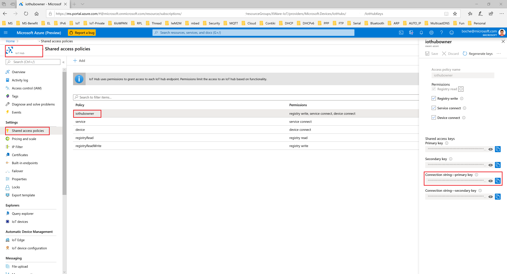
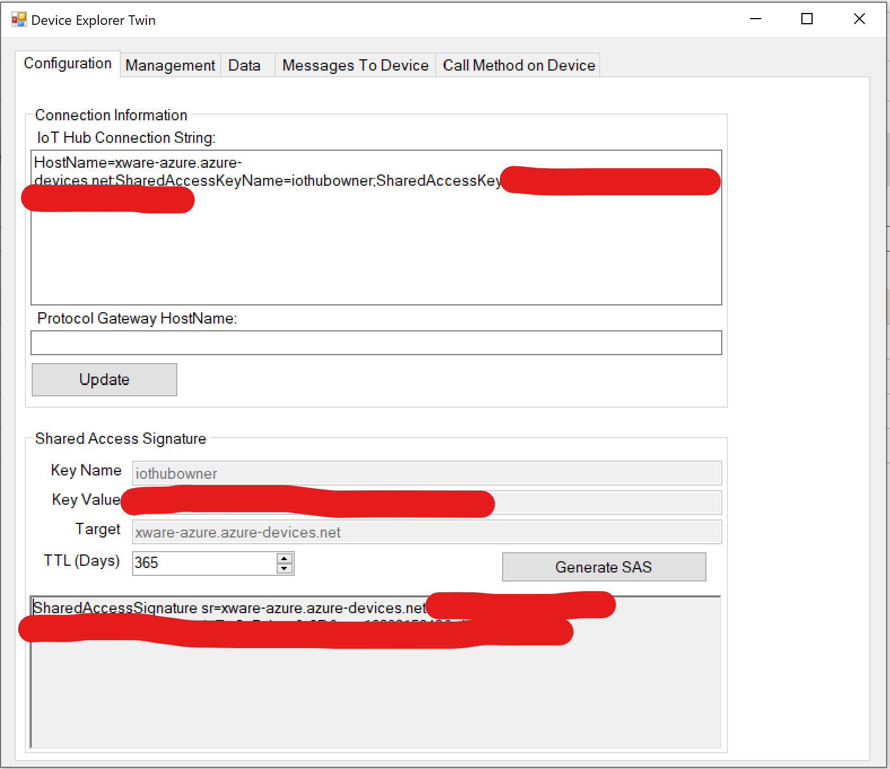
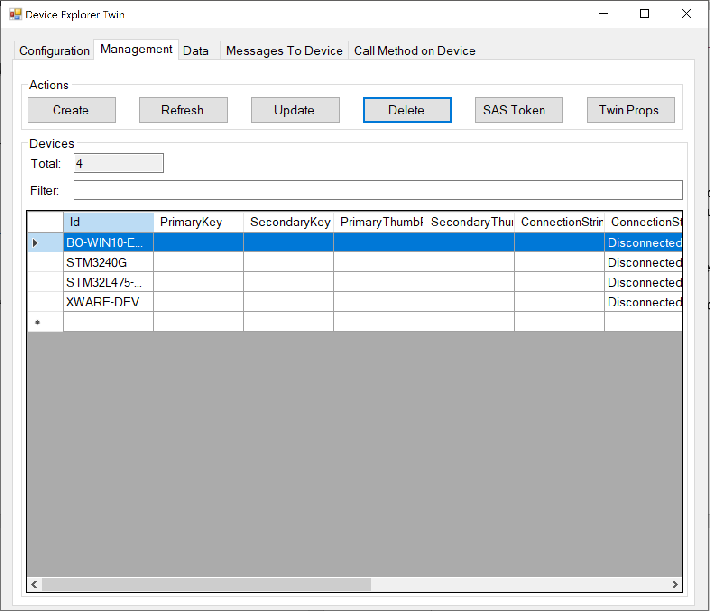
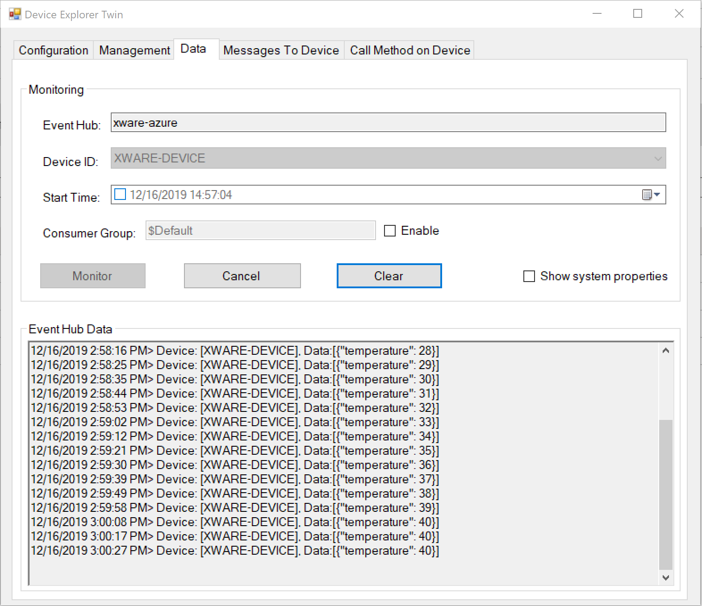
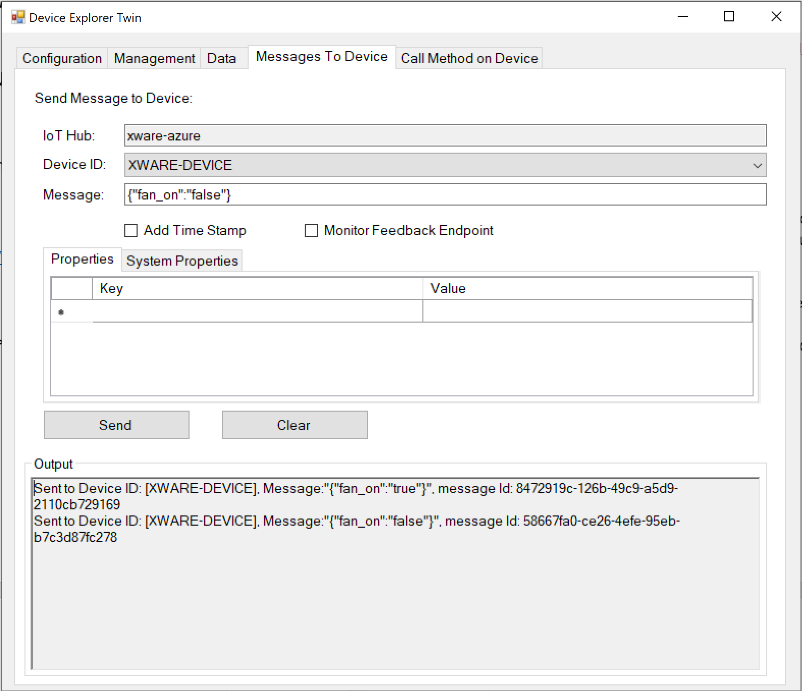

# Overview

This demo uses ThreadX MQTT to connect to IoT Hub directly, without C-SDK.

In this demo, we simulate the fan control application on the device. A fan can be turned on or off.


# Configure Azure IoT Hub for the demo

1. Create an IoT hub and Device using the Azure Portal.

    The  Azure IoT hub user guide can be found at: https://docs.microsoft.com/en-us/azure/iot-hub/iot-hub-create-through-portal

    Save the **IoT Hub Connection String** for later use.

    


2. Install Device Explorer.

    The installer for Device Explorer can be found at: https://github.com/Azure/azure-iot-sdk-csharp/releases/download/2019-9-11/SetupDeviceExplorer.msi


3. Run Device Explorer.

    In the “Configuration” pane, copy/paste the IoT Hub Connection String created in step1, click the “Update” button to generate Key Name, Key Value and Target, and click the “Generate SAS” button to generate SAS.

    

    The device ID can be verified in Management pane. And save the **IoT Hub name**, **Device ID**, **SAS** for later use.

    


# Configure and execute the example.

1. Refer to [README.md](../../project/x86/README.md) to generate simulator project on Windows/Linux or Click the xxx.eww project (such as: project/st/stm32f746g-disco/iar/x-ware_platform.eww) on Device in IAR EW for ARM version 8.42.


2. Update the **IoT Hub**, **Device ID** and **SAS** as yours in *demo_iot_security_module_mqtt.c*

    ```
    //
    // TODO`s: Configure core settings of application for your IoTHub, replace the [IoT Hub Name] and [Device ID] as yours. Use Device Explorer to generate [SAS].
    //

    #define IOT_HUB_NAME                "[IoT Hub Name]"
    #define IOT_HUB_SAS                 "[IoT Hub SAS]"
    #define DEVICE_ID                   "[Device ID]"

    //
    // END TODO section
    //
    ```

3. Download and run the project.

    As the project runs, the demo prints out status information to the terminal IO window. The demo publishes the message to IoT Hub every five seconds. Check the Terminal I/O to verify that messages have been successfully sent to the Azure IoT hub.

    ```
    DHCP In Progress...
    IP address: 10.172.0.69
    Mask: 255.255.254.0
    DNS Server address: 10.50.50.50
    Connected to server
    Subscribed to server
    [Published] topic = devices/XWARE-DEVICE/messages/events/, message: {"temperature": 21}
    [Published] topic = devices/XWARE-DEVICE/messages/events/, message: {"temperature": 22}
    [Published] topic = devices/XWARE-DEVICE/messages/events/, message: {"temperature": 23}
    [Published] topic = devices/XWARE-DEVICE/messages/events/, message: {"temperature": 24}
    [Published] topic = devices/XWARE-DEVICE/messages/events/, message: {"temperature": 25}
    [Published] topic = devices/XWARE-DEVICE/messages/events/, message: {"temperature": 26}
    ```


4. In the Device Explorer program, click the “Monitor” button in “Data” pane to view the messages published by the IoT device.

    In the Data pane, user can monitor the data transmitted from the device to the Azure cloud.

    In this demo, we simulate the fan control application on the device. A fan can be turned on or off. With the fan off, the demo increases the temperature by 1 degree till the temperature reaches the maximum value of 40. Once the temperature reaches 40, it does not increase any more.

    

    With fan turned on, the temperature decreases by 1 degree for every message till it reaches the minimum value of 0. Once the temperature reaches 0, it does not decrease any more.

    


5. Manually send messages to the device.

    In the Device Explorer program, switch to the “Messages To Device” pane, and user can send commands to the IoT node.

    In this demo, the following messages are defined:

        {"fan_on": "true"}
        {"fan_on": "flase"}

    User can send TurnFanOn message to Device to turn fan on. Device receives this message (to turn on fan), and in response decreases the temperature by 1 till the temperature reaches the minimum value of 0.

    

    User can send TurnFanOff message to Device to turn fan off. Device receives this message (to turn off fan), and in response increases the temperature by 1 till the temperature reaches the maximum value of 40.

    
